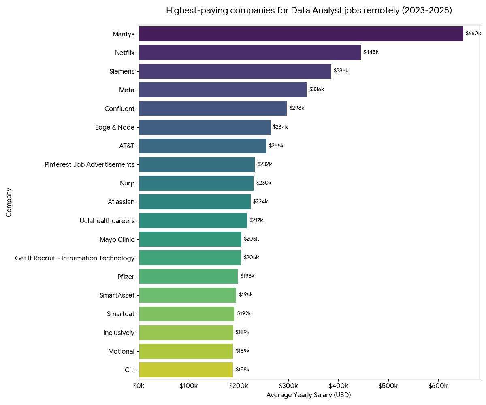

# 📊 Data Analyst Job Market Analysis 2023-2025: SQL Portfolio Project

## 🎯 Project Overview

This project explores the data analyst job market in 2023, analyzing top-paying roles, in-demand skills, and the intersection of salary and demand. The ultimate goal is to identify the most optimal technologies to master for an aspiring Data Analyst entering the job market.

## 🛠️ Tools & Technologies

- **SQL (PostgreSQL):** Complex queries involving CTEs (Common Table Expressions), multiple `INNER`/`LEFT JOIN`s, aggregations (`COUNT`, `AVG`, `ROUND`), filtering (`WHERE`, `HAVING`), data formatting, logical sorting.
- **Database Architecture:** Utilizing a star schema consisting of a main fact table (`job_postings_fact`) and supporting dimension tables (`skills_dim`, `company_dim`).
- **VS Code:** My IDE to executing the SQL and coding
- **Git & GitHub:** version control and sharing my SQL queries and the project

#### 🔍 SQL queries? Check them out here: [project_sql folder](/project_sql/)

## ✅ The 5 Core Questions Answered

1. **Top-Paying Companies:** What are the top 25 highest-paying Data Analyst companies available remotely?
2. **Elite Skill Requirements:** What specific technical skills do these top-paying companies demand (remote-jobs)?
3. **Skill Demand Globally:** What are the most frequently requested skills for Data Analysts across the entire job market?
4. **Avg Salary Per Skill:** What is the average pay for each skill?
5. **The Optimal Stack:** Which skills represent the "sweet spot" by offering both high market demand and high financial rewards?

## 📊 The Analysis

**1. Top-Paying Companies (remotely)**
[SQL Query1](/project_sql/1_top_paying_jobs.sql)

- Horizontal chart showing the highest-paying companies for Data Analyst job available remotely in 2023-2025 years;
- Mantys should be some anomally (doesn't show any skill requirements)

_Generated by GeminiAI Pro from my prompt and my SQL results in .csv_

**2. Skill Requirements for top-paying companies (remotely)**
[SQL Query2](/project_sql/2_top_paying_skills_job.sql)

- Made from 100 companies to have better results
- Tableau is pretty popular in these companies
- Excel is still needed even at the top
- Cloud and data are entering the "big game"

_Generated by GeminiAI Pro from my prompt and my SQL results in .csv_

**3. Skills Demanded Globally - Data Analyst**
[SQL Query3](/project_sql/3_top_demanded_skills.sql)

        🏆 The Big Four Data Analyst Stack 🏆

|     | Technology                                   | Job Postings | Note                                            |
| :-- | :------------------------------------------- | :----------- | :---------------------------------------------- |
| 1.  | **SQL**                                      | 198,761      | Absolute necessity                              |
| 2.  | **Data Visualization** _(Tableau & PowerBI)_ | 193,693      | Almost 1:1 (Tableau 51% vs PowerBI 49%).        |
| 3.  | **Excel**                                    | 144,995      | Still in front of Python and R                  |
| 4.  | **Python**                                   | 128,946      | Main programming language for advanced analysis |

_Generated by GeminiAI Pro from my prompt and SQL results in .csv_

**4. Avg Salary Per Skill:** [SQL Query4](/project_sql/4_salary_per_job_skill.sql)

- **The most wanted** is **SQL** and some **Visualization tool** _(Tableau or PowerBI)_ closely followed by **Excel**
- **Best skill for entry-job** is **Excel**. It has basically the lowest salary but it's _almost_ the most wanted skill
- The most valuable in the most job postings is "The Big 4" **SQL**, **Visualization tool**, **Excel** and **Python**
- **Advacend skills => Advanced salary:** Once you focus on **Cloud skills** _(Snowflake, AWS, Azure, Looker)_ the average salary rises, especially Snowflake
- **Snowflake** skill is skyrocketing in terms of salary

_Generated by GeminiAI Pro from my prompt and my SQL results in .csv_

    💎 The Optimal Stack: Core, Cloud & Curiosities 💎

| Kategorie         | Technologie                                   | Poptávka (Počet inzerátů) | Průměrný plat (USD) | Market Insight                                                         |
| :---------------- | :-------------------------------------------- | :------------------------ | :------------------ | :--------------------------------------------------------------------- |
| **The Big Four**  | **SQL**                                       | 10,641                    | $101,184            | Absolutní základ. Nejvyšší poptávka na trhu s velmi solidním platem.   |
| **The Big Four**  | **Data Visualization** _(Tableau & Power BI)_ | 10,462                    | $98,978             | Druhá nejžádanější kompetence. Firmy mezi nástroji příliš nerozlišují. |
| **The Big Four**  | **Excel**                                     | 8,716                     | $88,385             | Masivně žádaný, ale platově spadá do "komoditní" (levnější) zóny.      |
| **The Big Four**  | **Python**                                    | 7,064                     | $105,238            | Nejdražší z "Velké čtyřky". Klíč pro posun do seniorních rolí.         |
| **Cloud Premium** | **Snowflake**                                 | 1,069                     | **$122,329**        | **Absolutní platový vítěz.** Nízká poptávka, ale prémiové ohodnocení.  |
| **Cloud Premium** | **Cloud Platforms** _(AWS & Azure)_           | 2,197                     | $110,920            | Znalost cloudových ekosystémů automaticky posouvá plat nad $110k.      |
| **Curiosity**     | **Word**                                      | 1,784                     | $81,106             | Zastaralý požadavek u reportingu s nejnižším platem z celého žebříčku. |

## 💡 Key Business Insights

- **The Big 4:** The absolute foundation is **SQL**, appearing in the vast majority of job postings. Along with **Visual Tools** (_Tableau / Power BI_) and for advanced analysis **Python**. However, **Excel** also has a huge presence, especially for the Data Analyst (junior-ish) role
- **Beware of the "Niche Trap":** While highly specialized skills (like obscure cloud tools) show massive average salaries, their job market in 2023 demand is extremely low. Relying purely on salary data without checking the posting volume (`COUNT`) creates a skewed perspective.
- **Regional Strategy:** While the global remote market heavily features Tableau and Looker, the European and enterprise markets are deeply rooted in the Microsoft ecosystem. A foundational stack of **SQL, Excel, and Power BI** is the most strategic entry point for Junior/Medior roles.

## 🚀 Personal Takeaways

Over the course of a 3-week intensive sprint, I went from no knowledge of SQL through writing basic queries to understanding deeper database mechanics, such as handling missing data (`NULL` values) and optimizing query performance by choosing single-pass aggregations over unnecessary CTEs where appropriate.

## My Next Steps

- **Mastering Advanced Excel (Power Query/Power Pivot)**
- **Work on PowerBI**
- **Improve this SQL project**
  v1.9.
  1. Added actuall data 2023-2025
  2. Arrengements in SQL syntax to have more logic ("business") outcomes - incl. Query 1-4
     - working on Query 5 and 6
  3. Added "The Analysis" - deep dive into data and make key insight including charts and tables - incl. Query 1-4
